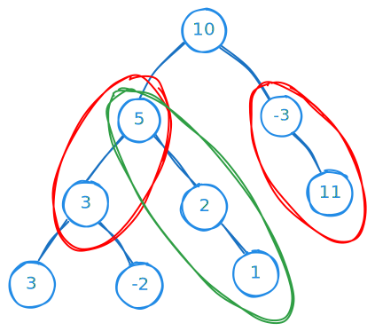

import { Callout, Steps, FileTree, Tabs } from "nextra/components";

# 437. Path Sum III

Given the `root` of a binary tree and an integer `targetSum`, return the number of paths where the sum of the values along the path equals `targetSum`.

The path does not need to start or end at the root or a leaf, but it must go downwards (i.e., traveling only from parent nodes to child nodes).

**Example 1:**



```js
Input: root = [10,5,-3,3,2,null,11,3,-2,null,1], targetSum = 8
Output: 3
Explanation: The paths that sum to 8 are shown.
```

**Example 2:**

```js
Input: (root = [5, 4, 8, 11, null, 13, 4, 7, 2, null, null, 5, 1]),
  (targetSum = 22);
Output: 3;
```

## Solution

<details>
<summary> Details </summary>

<br />

```cpp showLineNumbers
class Solution {
public:
    unordered_map<long, int> mp; // sum, number of paths
    int ans = 0;
    int pathSum(TreeNode* root, int targetSum) {
        ans = 0;
        mp[0] = 1;
        dfs(root, targetSum, 0);
        return ans;
    }
    void dfs(TreeNode* root, int target, long sum) {
        if (!root)
            return;
        sum += root->val;
        if (mp.find(sum - target) != mp.end())
            ans += mp[sum - target];
        mp[sum]++;
        dfs(root->left, target, sum);
        dfs(root->right, target, sum);
        mp[sum]--;
    }
};
```

</details>
