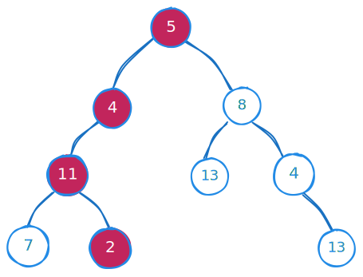

import { Callout, Steps, FileTree, Tabs } from "nextra/components";

# Path Sum

Given the `root` of a binary tree and an integer `targetSum`, return `true` if the tree has a **root-to-leaf** path such that adding up all the values along the path equals `targetSum`.

A leaf is a node with no children.

## Example 1:



```js
Input: root = [5,4,8,11,null,13,4,7,2,null,null,null,1], targetSum = 22
Output: true
Explanation: The root-to-leaf path with the target sum is shown
```

## Approach

<details>
<summary>Details</summary>

This is the first solution that come to mind when we think of the problem. We can use a recursive approach to solve this problem.

<Steps>

### Check for Empty Tree

If the `root` is `NULL`, return false because an empty tree doesn't contain any paths.

### Update Target Sum

Subtract the value of the current node from the targetSum. This step helps to track the remaining sum needed to reach the targetSum as we traverse down the tree.

### Check Leaf Node and Target Sum

If the current node is a `leaf node` and the `targetSum` equals `0`, return `true`. This indicates that a path from the root to this leaf node exists with the desired sum.

Return `false` otherwise.

### Recursive Calls

Recursively call the hasPathSum function for the left and right subtrees, passing the updated targetSum. This step explores all possible paths in the tree.

### Check for Path Existence

Return `true` if either the **left subtree** or the **right subtree** has a path with the **desired sum**. This is achieved by using a logical **OR** operation on the results obtained from recursive calls.

</Steps>

</details>

## Solution

<details>
<summary>Details</summary>

This is the implementation of the approach mentioned above.

```cpp copy
class Solution {
public:
    bool hasPathSum(TreeNode* root, int targetSum) {
        if(root == NULL) return false;

        targetSum=targetSum-root->val;

        if(targetSum == 0 && root->left==NULL && root->right==NULL) return true;

        bool left = hasPathSum(root->left,targetSum);
        bool right = hasPathSum(root->right,targetSum);

        return left || right;
    }
};
```

</details>

<Callout type="info">Time Complexity: O(N), Space Complexity: O(N)</Callout>
