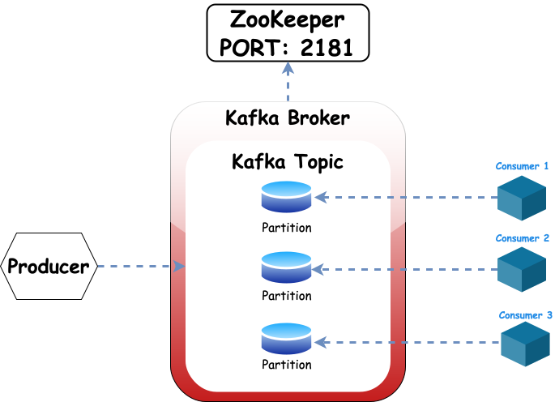

import { Callout, Steps, FileTree, Tabs } from "nextra/components";

# Basic Kafka Setup

## What is ZooKeeper?

ZooKeeper is a centralized service for maintaining the Kafa cluster. It is used to manage and coordinate Kafka brokers. ZooKeeper is used to elect a controller, store metadata, and maintain the state of the Kafka cluster.

ZooKeeper takes care of the following tasks:

- Electing a controller
- Managing broker metadata
- Maintaining the state of the Kafka cluster
- Managing the configuration of the Kafka cluster

<Callout>
  ZooKeeper is used for self-balacing and fault-tolerance in Kafka.
</Callout>
## Setup

Start Zookeper Container and expose PORT `2181`.

```bash
docker run -p 2181:2181 ZooKeeper
```

Start Kafka Container, expose PORT `9092` and setup ENV variables.

```bash
docker run -p 9092:9092 \
-e KAFKA_ZOOKEEPER_CONNECT=<PRIVATE_IP>:2181 \
-e KAFKA_ADVERTISED_LISTENERS=PLAINTEXT://<PRIVATE_IP>:9092 \
-e KAFKA_OFFSETS_TOPIC_REPLICATION_FACTOR=1 \
confluentinc/cp-kafka
```

<Callout>
  `PRIVATE_IP` means the IP address of the machine where the containers are
  running.
</Callout>

## Architecture

The following diagram shows the architecture of Kafka with ZooKeeper.

<br />

<div align ="center">



</div>
