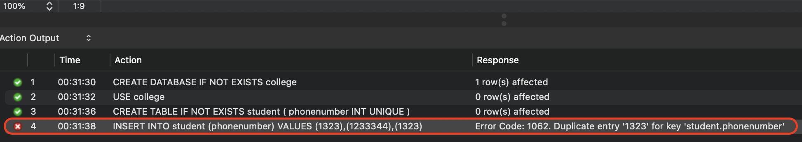
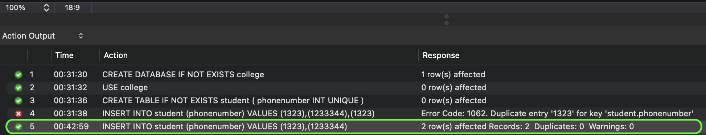
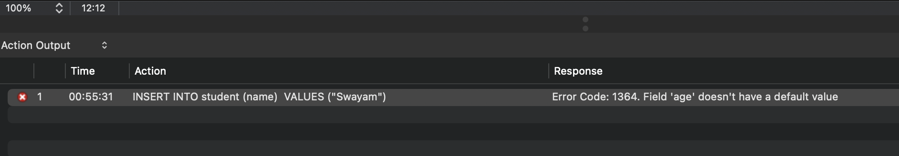
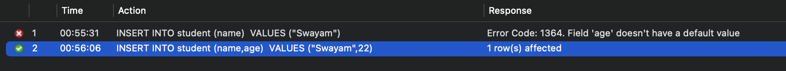
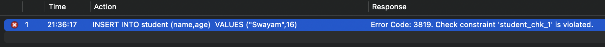
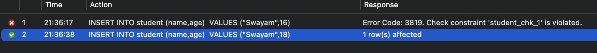
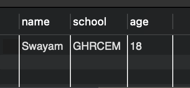

import { Callout, Steps, FileTree, Tabs } from "nextra/components";

# Constraints

Constraints defines rules or restrictions that are enforced on data columns in a table. These are used to prevent invalid data from being entered into the database. This ensures the accuracy and reliability of the data in the database.

## Types of Constraints

There are several types of constraints in SQL. They are:

1. `NOT NULL`: Ensures that a column cannot have a NULL value.
2. `UNIQUE`: Ensures that all values in a column are different.
3. `PRIMARY KEY`: A combination of a NOT NULL and UNIQUE. Uniquely identifies each row in a table.
4. `FOREIGN KEY`: Uniquely identifies a row/record in another table.
5. `CHECK`: Ensures that all values in a column satisfy a specific condition.
6. `DEFAULT`: Sets a default value for a column when no value is specified.
7. `INDEX`: Used to create and retrieve data from the database very quickly.

## Examples

### UNIQUE Constraint

The `UNIQUE` constraint ensures that all values in a column are different. For example, if we have a table `student` where **phonenumber** is one of the columns, we can use the `UNIQUE` constraint to ensure that all phone numbers are unique.

<details>
  <summary>Click to see the details</summary>

Let's create a table `student` with a `phonenumber` column and add a `UNIQUE` constraint to it.

```sql filename="table.sql"
CREATE TABLE IF NOT EXISTS student (
phonenumber INT UNIQUE
);
```

<Callout>
  This will ensure that all phone numbers in the `student` table are unique.
</Callout>

**Expected Output for wrong query:**

```sql filename="example_query.sql"
-- Inserting values in college
INSERT INTO student (phonenumber) VALUES
(1323),(1233344),(1323);
```

**Output:**



**Correct way:**

```sql filename="example_query.sql"
-- Inserting values in college
INSERT INTO student (phonenumber) VALUES
(1323),(1233344);
```

**Output:**



</details>

### NOT NULL Constraint

NOT NULL constraint ensures that a **column cannot have a NULL value**.

<details>
  <summary>Click to see the details</summary>

Let's create a table `student` with a `name` and `age` column. We will add a `NOT NULL` constraint to the `age` column.

```sql filename="table.sql" {3}
CREATE TABLE IF NOT EXISTS student (
name VARCHAR(50),
age INT NOT NULL
);
```

The `NOT NULL` constraint ensures that a column **cannot have a NULL value**. In the above example, the `age` column cannot have a NULL value.

**Example:**

```sql filename="example_query.sql"
INSERT INTO student (name) VALUES ('Swayam');
```

**Output:**



**Correct Code:**

```sql filename="example_query.sql"
INSERT INTO student (name, age) VALUES ('Swayam', 22);
```

**Output:**



<Callout>
  The `NOT NULL` constraint ensures that the `age` column cannot have a NULL
  value.
</Callout>

</details>

### CHECK Constraint

The `CHECK` constraint ensures that all values in a column satisfy a specific condition.

<details>
  <summary>Click to see the details</summary>

Let's create a table `student` with a `age` column. We will add a `CHECK` constraint to the `age` column to ensure that the age is greater than 18.

```sql filename="table.sql" {3}
CREATE TABLE IF NOT EXISTS student (
name VARCHAR(50),
age INT CHECK (age > 18)
);
```

<Callout>
  The `CHECK` constraint ensures that all values in the `age` column are greater
  than 18.
</Callout>

**Example:**

```sql filename="example_query.sql"
INSERT INTO student (name, age) VALUES ('Swayam', 16);
```

**Output:**



**Correct Code:**

```sql filename="example_query.sql"
INSERT INTO student (name, age) VALUES ('Swayam', 18);
```

**Output:**



</details>

### DEFAULT Constraint

The `DEFAULT` constraint sets a default value for a column when no value is specified.

<details>
  <summary>Click to see the details</summary>

Let's create a table `student` with a `school` column. We will add a `DEFAULT` constraint to the `school` column to set a default value.

```sql filename="table.sql"
CREATE TABLE IF NOT EXISTS student (
name VARCHAR(50),
school VARCHAR(50) DEFAULT 'GHRCEM',
age INT NOT NULL CHECK (age >=18)
);
```

<Callout>
  The `DEFAULT` constraint sets the default value of the `school` column to
  'GHRCEM'.
</Callout>

**Example:**

```sql filename="example_query.sql"
INSERT INTO student (name, age)
VALUES ('Swayam', 22);
```

**Output:**



</details>

### PRIMARY KEY Constraint

Primary key constraint uniquely identifies each row in a table.

<details>
  <summary>Click to see the details</summary>

<Callout>
  **`Unique + Not Null`** constraints are automatically added to the primary key
  column.
</Callout>

```sql filename="table.sql"
CREATE TABLE IF NOT EXISTS student (
name VARCHAR(50),
school VARCHAR(50) DEFAULT 'GHRCEM',
age INT NOT NULL CHECK (age >=18),
rollnumber INT PRIMARY KEY
);
```

<Callout>
  The `PRIMARY KEY` constraint ensures that the `rollnumber` column uniquely
  identifies each row in the `student` table.
</Callout>

Inserting values into the table:

```sql filename="example_query.sql"
-- Inserting values in TABLE student
INSERT INTO student (name,age, rollnumber)
VALUES
("Swayam",18,1),
("Ravi",21,2);
```

</details>

## FOREIGN KEY Constraint

The `FOREIGN KEY` constraint uniquely identifies a row/record in another table.

 <details>
   <summary>Click to see the details</summary>

Let's create two tables `student` and `student2`. The `student2` table has a `rollnumber` column, which is a foreign key that references the `rollnumber` column in the `student` table.

```sql filename="foreign.sql"
CREATE TABLE student2 (
name VARCHAR(50),
rollnumber INT,
FOREIGN KEY (rollnumber) REFERENCES student(rollnumber)
);
```

Create a relationship between two tables. The `student` table has a `rollnumber` column, which is a foreign key that references the `rollnumber` column in the `marks` table.

 </details>
