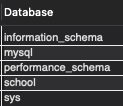

import { Callout, Steps, FileTree, Tabs } from "nextra/components";

# Database Queries

Here are some examples of how to query the database using the `sql` function.

## Basic Query on DB

```sql filename="database-query.sql"
CREATE DATABASE school;
```

Syntax: `CREATE DATABASE database_name;`

<Callout>This creates a DATABASE by name school!</Callout>

## Creating DB with IF NOT EXISTS

```sql filename="database-query.sql"
CREATE DATABASE IF NOT EXISTS school;
```

Syntax: `CREATE DATABASE IF NOT EXISTS database_name;`

<Callout>This creates a DATABASE by name school if it does not exist!</Callout>

**MySQL Workbench Example:**


<Callout type="info">
  This give us warning not error! If the database already exists, it will not
  create a new one. Instead, it will return a message saying that the database
  already exists.
</Callout>

## USE DB

Inorder to perform operations on a database, we need to use it.

```sql filename="database-query.sql"
USE school;
```

Syntax: `USE database_name;`

## Show Databases

```sql filename="database-query.sql"
SHOW DATABASES;
```

**MySQL Workbench Example:**



<Callout>This will show all the databases in the server!</Callout>
